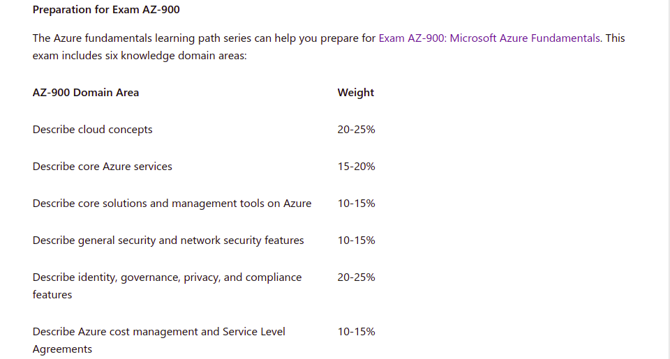

<!-- This template removes the micro tutorial for a quicker post and removes images for a full template check out the 000-DAY-ARTICLE-LONG-TEMPLATE.MD-->

**Preparing for AZ-900 Fundamentals:-**

# Selecting AZURE

## Introduction

There are so many cloud platforms to start our career in cloud..

1. Amazon Web Services (AWS)
2. Microsoft Azure
3. Google Cloud.

and many more...
among this I chose Microsoft Azure to start in this 100DaysOfCloud challenge

## Short term Goal

I want to complete the AZ-900 certification as part of this 100DaysOfCloud challenge.For this I have choosen microsoft Documentations for my preparation.

## Reference links

[Azure Fundamentals part 1](https://docs.microsoft.com/en-in/learn/paths/az-900-describe-cloud-concepts/?WT.mc_id=api_CatalogApi)

## Social Proof

[LinkdIn](https://www.linkedin.com/posts/kuntumalla-mahesh-7674b8145_100daysofcloud-az900-azure-activity-6828365292499017728-64fW)
