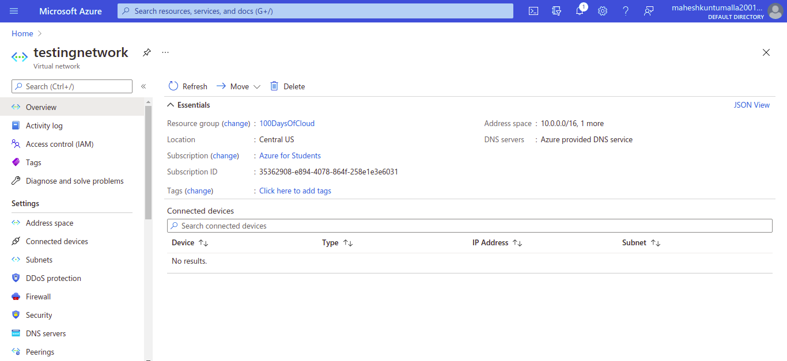

<!-- This is a template you can use for quick progress days. It removes a lot of the steps we encourage you to share in the longer template 000-DAY-ARTICLE-LONG-TEMPLATE.MD-->

# Creat virtual network

## understanding IPv4 

ipv4 ranges from 0.0.0.0 to 255.255.255.255
this range divided into two groups.

## 1.private ip address
These is again sub divided into 3 classes.
1. class - A 10.0.0.0 – 10.255.255.255 ( large scale companies)
2. class - B 172.16.0.0 – 172.31.255.255(small scale companies)
3. class - c 192.168.0.0 – 192.168.255.255(for laboratory use)

These ip addresses were used in companies to make communications between resources.And there is no cost for using this ip addresses,but make sure that ip addresses are not overlapping on one another.

## 2.public ip address
These are ip addresses where u need to pay for using them.Even our mobile phones network using the public ip address where we are paying amount without knowing about it.

coming to range of this addresses is except private ip ranges,remaining all ranges and combinations will come under public ip addresses.

## Social Proof

[LinkdIn](https://www.linkedin.com/posts/kuntumalla-mahesh-7674b8145_day8-100daysofcloud-az900-activity-6830921222507913216-v4t8)
